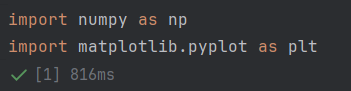
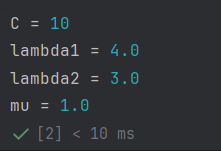
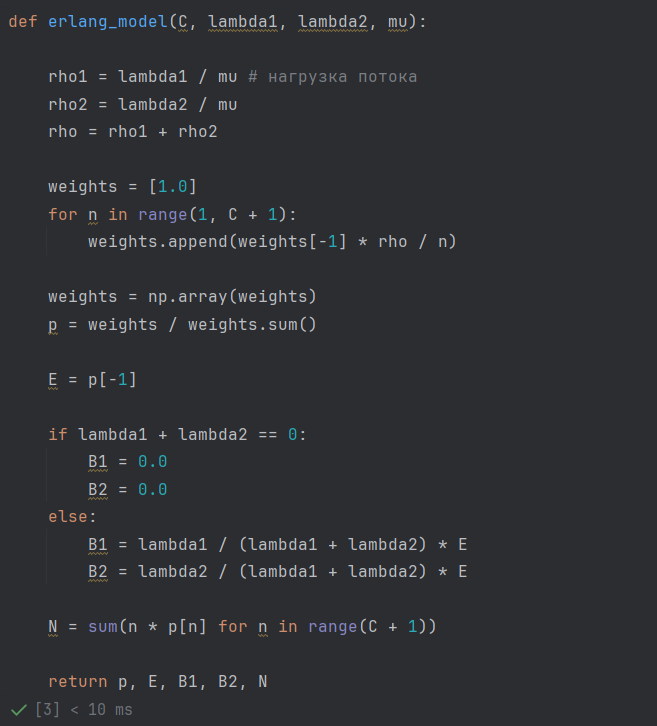
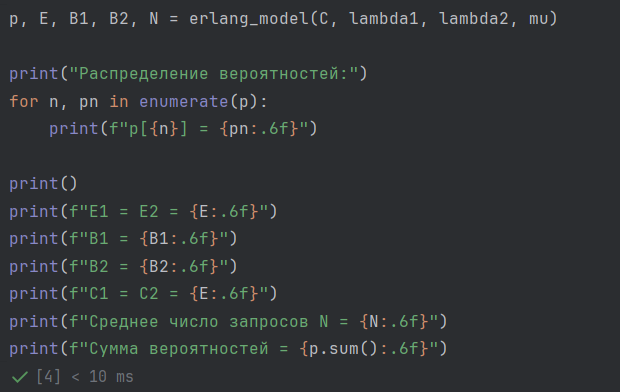
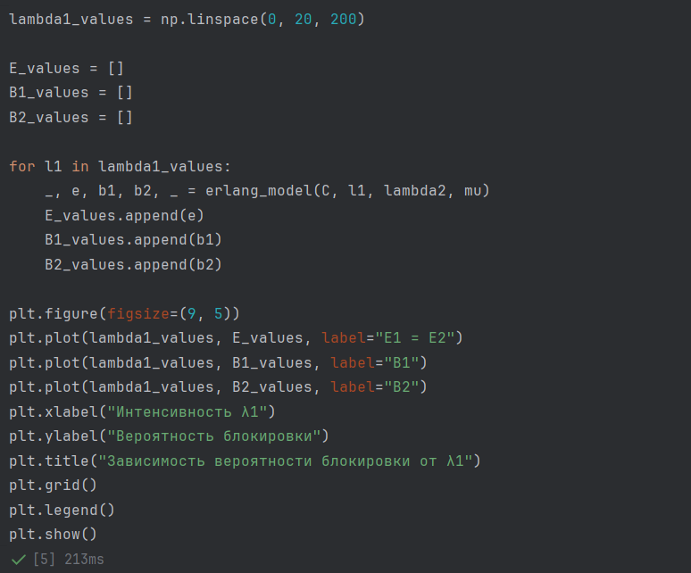
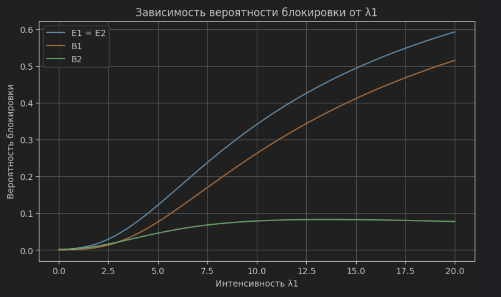
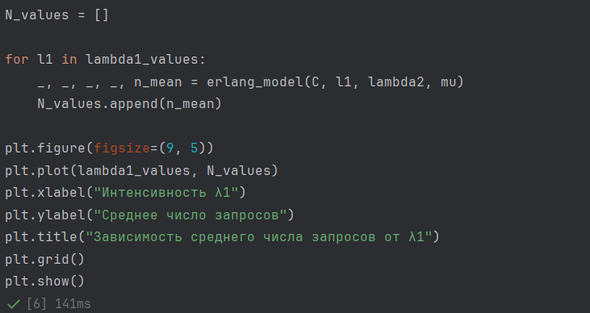
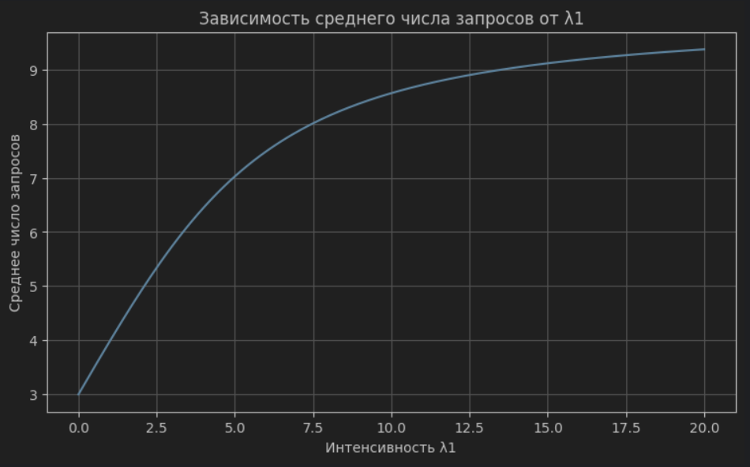

# Теоретические сведения

Исследуется полнодоступная двухсервисная модель Эрланга. Система имеет емкость $C$ и обслуживает запросы двух типов, поступающие с интенсивностями $\lambda_1$ и $\lambda_2$.

Для обоих типов запросов интенсивность обслуживания одинакова:

$$
\mu_1=\mu_2=\mu.
$$

Интенсивности предложенной нагрузки:

$$
\rho_1=\frac{\lambda_1}{\mu},
\qquad
\rho_2=\frac{\lambda_2}{\mu}.
$$

Суммарная нагрузка:

$$
\rho=\rho_1+\rho_2.
$$

Состояние системы определяется числом одновременно обслуживаемых запросов:

$$
X=\{0,1,\ldots,C\}.
$$

Если система находится в состоянии $C$, все ресурсы заняты, поэтому новый запрос блокируется.

Стационарное распределение вероятностей:

$$
p_n=
\frac{\rho^n/n!}
{\displaystyle\sum_{i=0}^{C}\rho^i/i!},
\qquad
n=0,1,\ldots,C.
$$

Вероятность блокировки по времени:

$$
E_1=E_2=E=p_C.
$$

Вероятность блокировки по вызовам для каждого типа:

$$
B_i=
\frac{\lambda_i}{\lambda_1+\lambda_2}E.
$$

Вероятность блокировки по нагрузке:

$$
C_1=C_2=E.
$$

Среднее число обслуживаемых запросов:

$$
N=\sum_{n=0}^{C}n p_n.
$$

# Алгоритм расчета

1. Задать $C$, $\lambda_1$, $\lambda_2$ и $\mu$.
2. Рассчитать $\rho_1$, $\rho_2$ и суммарную нагрузку $\rho$.
3. Для каждого состояния системы рассчитать вес $\rho^n/n!$.
4. Нормировать полученные значения и получить вероятности $p_n$.
5. Определить вероятность блокировки по времени $E=p_C$.
6. Рассчитать вероятности блокировки по вызовам $B_1$ и $B_2$.
7. Рассчитать среднее число запросов $N$.
8. Изменяя $\lambda_1$, построить зависимости вероятностей блокировки и среднего числа запросов от интенсивности входящего потока.

# Численный анализ

В программе используются следующие исходные значения:

$$
C=10,\qquad
\lambda_1=4,\qquad
\lambda_2=3,\qquad
\mu=1.
$$

Именно эти параметры используются в программе.

## Импорт библиотек

Для вычислений используется библиотека NumPy, а для построения графиков — Matplotlib.

{#fig-001 width=70%}

## Исходные данные

{#fig-002 width=70%}

## Функция расчета характеристик модели

В программе все основные характеристики рассчитываются одной функцией `erlang_model`.

Сначала проверяется корректность исходных данных. Затем рассчитываются нагрузки $\rho_1$, $\rho_2$ и их сумма $\rho$.

Для вычисления стационарных вероятностей сначала формируется массив весов. Первый вес равен 1, а каждый следующий рассчитывается через предыдущий:

$$
w_n=w_{n-1}\frac{\rho}{n}.
$$

Такой способ соответствует выражению $\rho^n/n!$, но позволяет не вычислять степень и факториал отдельно для каждого состояния.

После этого веса нормируются:

$$
p_n=\frac{w_n}{\sum w_n}.
$$

Последний элемент массива вероятностей является вероятностью блокировки:

$$
E=p_C.
$$

Затем рассчитываются $B_1$, $B_2$ и среднее число запросов $N$.

{#fig-003 width=70%}

## Расчет характеристик для заданных значений

Функция возвращает пять значений:

- `p` — массив стационарных вероятностей;
- `E` — вероятность блокировки по времени;
- `B1` — вероятность блокировки по вызовам для первого типа;
- `B2` — вероятность блокировки по вызовам для второго типа;
- `N` — среднее число запросов в системе.

{#fig-004 width=70%}

Дополнительно выводится сумма всех стационарных вероятностей. Она должна быть равна 1, что позволяет проверить правильность нормировки распределения.

## Зависимость вероятности блокировки от интенсивности

Для исследования влияния интенсивности входящего потока изменяется $\lambda_1$ от 0 до 20. Значения $C$, $\lambda_2$ и $\mu$ остаются постоянными.

В строке

```python
_, e, b1, b2, _ = erlang_model(C, l1, lambda2, mu)
```

функция снова возвращает пять значений. Для этого графика нужны только `E`, `B1` и `B2`. Поэтому первое значение `p` и последнее значение `N` записываются в `_`, то есть фактически не используются.

Полученные значения сохраняются в трех списках:

- `E_values`;
- `B1_values`;
- `B2_values`.

После этого все три зависимости строятся на одном графике.

{#fig-005 width=70%}

{#fig-006 width=70%}

## Зависимость среднего числа запросов от интенсивности

Для второго графика используются те же значения $\lambda_1$. На каждой итерации требуется только среднее число запросов `N`.

В строке

```python
_, _, _, _, n_mean = erlang_model(C, l1, lambda2, mu)
```

из пяти возвращаемых функцией значений используется только последнее — среднее число запросов `N`. Остальные значения в этой части программы не нужны.

{#fig-007 width=70%}

{#fig-008 width=70%}

# Вывод

В ходе лабораторной работы была реализована программа для расчета характеристик полнодоступной двухсервисной модели Эрланга.

Для заданных $C$, $\lambda_1$, $\lambda_2$ и $\mu$ программа рассчитывает стационарное распределение вероятностей, вероятность блокировки по времени, вероятности блокировки по вызовам для двух типов запросов и среднее число запросов в системе.

При увеличении $\lambda_1$ общая нагрузка на систему увеличивается. В результате возрастает вероятность того, что все $C$ каналов будут заняты, поэтому вероятность блокировки увеличивается. Среднее число одновременно обслуживаемых запросов также увеличивается и при большой нагрузке приближается к емкости системы $C$.
