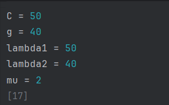
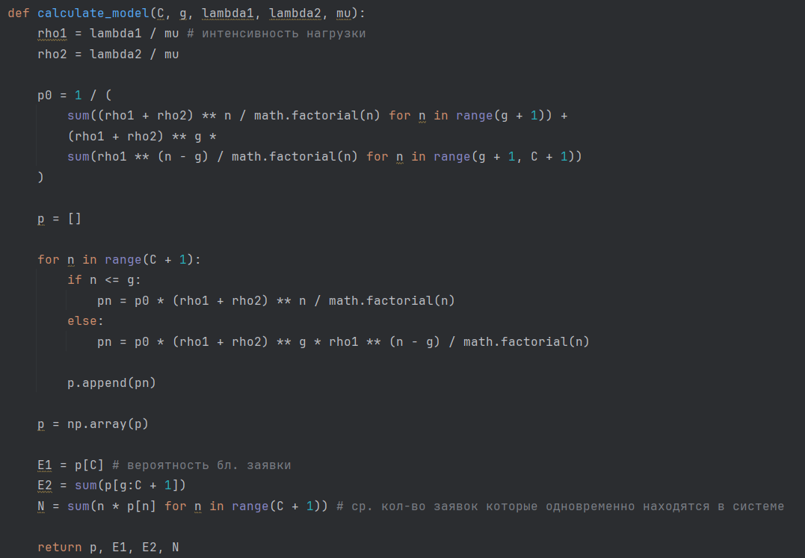
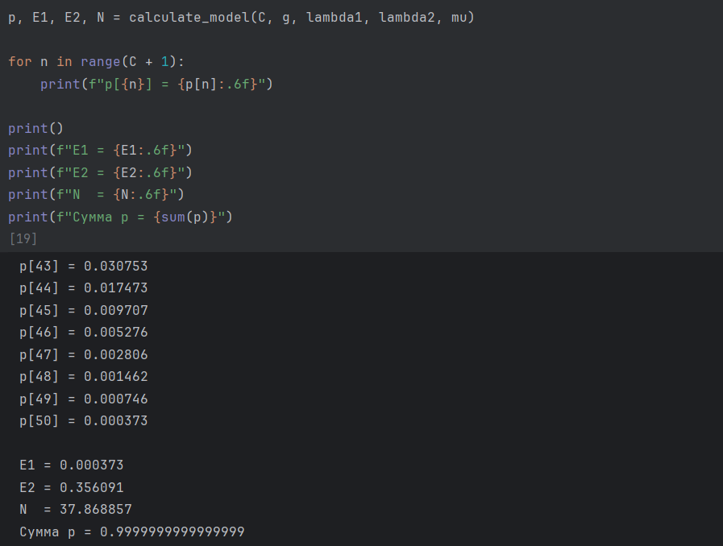
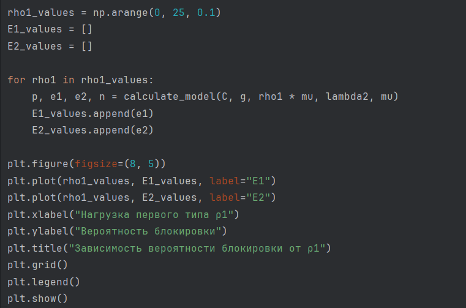
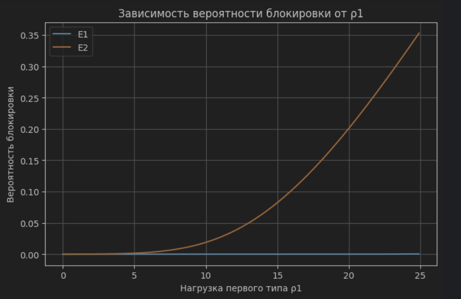
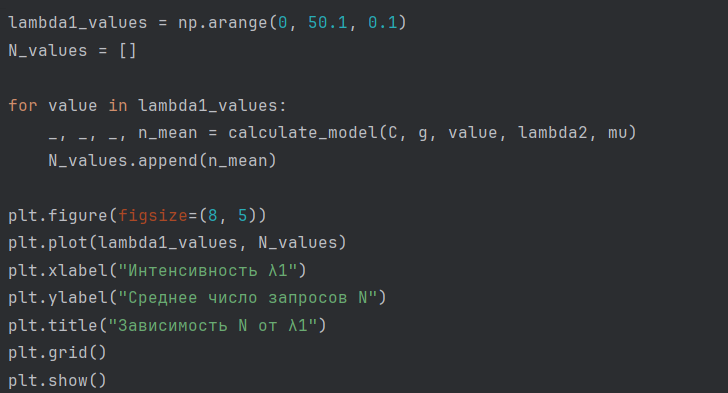
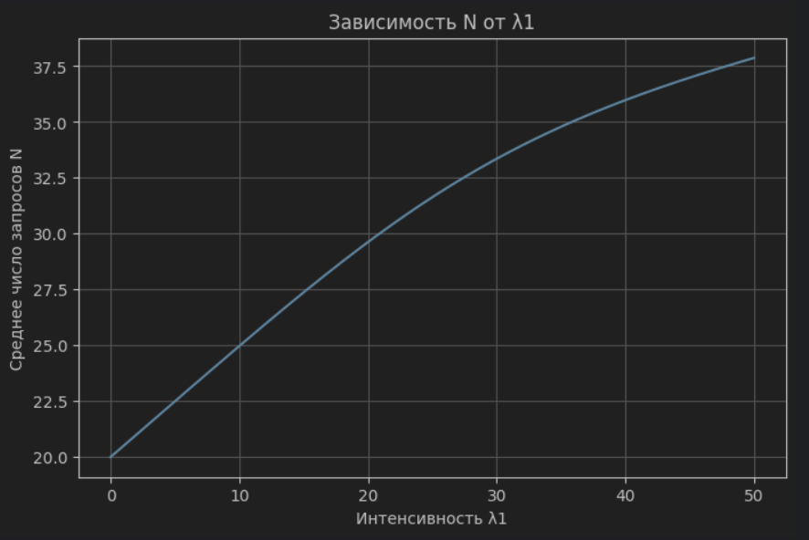

# Задание 1

## 1. Алгоритм расчета вероятностных характеристик модели

**Шаг 1: Ввод исходных данных**

$C$ — общая емкость системы;

$g$ — полнодоступная часть емкости;

$C-g$ — часть емкости, зарезервированная для запросов первого типа;

$\lambda_1$ — интенсивность поступления запросов первого типа;

$\lambda_2$ — интенсивность поступления запросов второго типа;

$\mu$ — интенсивность обслуживания.

**Шаг 2: Расчет интенсивностей предложенной нагрузки**

$$
\rho_1=\frac{\lambda_1}{\mu},
\qquad
\rho_2=\frac{\lambda_2}{\mu}.
$$

**Шаг 3: Расчет вероятности нулевого состояния**

Вероятность $p_0$ определяется из условия нормировки стационарного распределения:

$$
p_0=
\left[
\sum_{n=0}^{g}\frac{(\rho_1+\rho_2)^n}{n!}
+
(\rho_1+\rho_2)^g
\sum_{n=g+1}^{C}\frac{\rho_1^{n-g}}{n!}
\right]^{-1}.
$$

**Шаг 4: Расчет стационарных вероятностей состояний**

Для состояний от $0$ до $g$ запросы обоих типов могут поступать в систему:

$$
p_n=p_0\frac{(\rho_1+\rho_2)^n}{n!},
\qquad n=0,1,\ldots,g.
$$

Для состояний от $g+1$ до $C$ запросы второго типа блокируются, поэтому учитывается только нагрузка первого типа:

$$
p_n=p_0\frac{(\rho_1+\rho_2)^g\rho_1^{n-g}}{n!},
\qquad n=g+1,\ldots,C.
$$

**Шаг 5: Расчет вероятностей блокировки**

Запрос первого типа блокируется только при полном заполнении системы:

$$
E_1=p_C.
$$

Запрос второго типа блокируется при занятости $g$ и более каналов:

$$
E_2=p_g+p_{g+1}+\ldots+p_C.
$$

**Шаг 6: Расчет среднего числа запросов в системе**

$$
N=0\cdot p_0+1\cdot p_1+2\cdot p_2+\ldots+C\cdot p_C.
$$

# Задание 2

Программа реализует алгоритм расчета вероятностных характеристик неполнодоступной двухсервисной модели Эрланга с зарезервированной емкостью. Для заданных параметров рассчитываются интенсивности предложенной нагрузки, вероятность нулевого состояния, стационарное распределение вероятностей, вероятности блокировки запросов первого и второго типов и среднее число обслуживаемых запросов.

В программе используются следующие исходные значения:

$$
C=10,
\qquad
g=7,
\qquad
\lambda_1=4,
\qquad
\lambda_2=3,
\qquad
\mu=1.
$$

{#fig-001 width=70%}

Основные вычисления выполняются функцией `calculate_model`. Вначале рассчитываются $\rho_1$ и $\rho_2$, затем непосредственно по формулам определяется $p_0$ и все вероятности $p_n$. После этого рассчитываются $E_1$, $E_2$ и $N$.

{#fig-002 width=70%}

После вызова функции программа выводит распределение вероятностей состояний системы и основные вероятностные характеристики.

{#fig-003 width=70%}

Для заданных исходных данных получены следующие результаты:

$$
E_1=0.018406,
$$

$$
E_2=0.375029,
$$

$$
N=5.801286.
$$

**1. Распределение вероятностей $p(n)$.** Вероятности состояний возрастают до максимального значения при $n=6$ и $n=7$, где $p_n\approx0.2071$, после чего начинают уменьшаться. После заполнения полнодоступной части $g=7$ новые запросы второго типа больше не принимаются, поэтому для состояний выше $g$ распределение определяется только поступлением запросов первого типа. Сумма всех вероятностей равна 1, что подтверждает правильность нормировки.

**2. Вероятности блокировки.** Значение $E_1=0.0184$, то есть вероятность блокировки запроса первого типа составляет примерно $1.84\%$. Первый тип блокируется только при полном заполнении всех $C=10$ каналов. Значение $E_2=0.3750$, то есть вероятность блокировки запроса второго типа составляет примерно $37.50\%$. Второй тип блокируется уже при занятости $g=7$ и более каналов, так как не имеет доступа к зарезервированной части емкости.

**3. Среднее число запросов.** Получено $N=5.8013$. Это означает, что при заданных параметрах в системе в среднем одновременно обслуживается около 5.8 запроса. При общей емкости $C=10$ средняя занятость системы составляет около $58\%$.

# Задание 3

Для исследования зависимости вероятностей блокировки от интенсивности предложенной нагрузки первого типа значение $\rho_1$ изменяется от 0 до 15 с шагом 0.1. Параметры $C$, $g$, $\lambda_2$ и $\mu$ остаются постоянными.

Для каждого значения $\rho_1$ заново рассчитываются вероятности блокировки $E_1$ и $E_2$, после чего полученные значения сохраняются в списках `E1_values` и `E2_values`.

{#fig-004 width=70%}

{#fig-005 width=70%}

С увеличением нагрузки первого типа система становится более загруженной, поэтому вероятность блокировки обоих типов увеличивается. Вероятность $E_2$ на всем диапазоне выше $E_1$, поскольку запросы второго типа перестают приниматься уже после заполнения полнодоступной части $g$, тогда как запросы первого типа могут использовать всю емкость $C$. При больших значениях $\rho_1$ система все чаще находится в состояниях с большим числом занятых каналов, поэтому обе вероятности блокировки возрастают.

# Задание 4

Для исследования зависимости среднего числа обслуживаемых запросов от интенсивности поступления запросов первого типа значение $\lambda_1$ изменяется от 0 до 15 с шагом 0.1. Остальные параметры системы остаются постоянными.

Для каждого значения $\lambda_1$ рассчитывается среднее число запросов $N$, после чего полученные значения сохраняются в списке `N_values`.

{#fig-006 width=70%}

{#fig-007 width=70%}

Среднее число обслуживаемых запросов увеличивается с ростом интенсивности поступления запросов первого типа. При малой интенсивности система большую часть времени имеет свободную емкость, поэтому рост $\lambda_1$ приводит к заметному увеличению $N$. При больших значениях $\lambda_1$ рост среднего числа запросов замедляется, поскольку число одновременно обслуживаемых запросов не может превышать общую емкость системы $C=10$.

# Вывод

В ходе лабораторной работы была исследована неполнодоступная двухсервисная модель Эрланга с одинаковыми интенсивностями обслуживания и зарезервированной емкостью.

Для заданных параметров были рассчитаны стационарное распределение вероятностей, вероятности блокировки запросов первого и второго типов и среднее число обслуживаемых запросов. Результаты показывают, что резервирование части емкости для запросов первого типа существенно уменьшает вероятность их блокировки, но одновременно увеличивает вероятность блокировки запросов второго типа.

При увеличении нагрузки первого типа вероятности блокировки $E_1$ и $E_2$ возрастают. Среднее число обслуживаемых запросов также увеличивается с ростом интенсивности поступления и при большой нагрузке приближается к максимальной емкости системы $C$.
